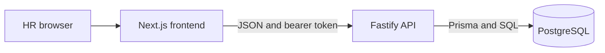

# Architecture — ACME Salary Management

## Runtime and boundaries

The repository has `frontend/` and `backend/`, each with its own package lock and commands. The browser renders the authenticated application; protected data comes from the API after session validation. The backend owns validation, salary changes and aggregates. Docker Compose starts PostgreSQL for local development only. Deployment targets are Render for the API/database and Vercel for the frontend; neither is provisioned by this repository.

## Backend

- `src/app.ts` assembles Fastify routes, one CORS origin, authentication and error rendering. `src/server.ts` starts the listener and handles shutdown.
- Employee route adapters parse input and call services; services use Prisma for filtered, sorted, offset-paginated queries and mutations. Only one page of at most 100 employees is sent to the client.
- `src/salary.ts` closes the old current interval and inserts the next salary in a transaction that locks the employee. Effective dates must increase. The migration's partial unique index allows at most one open salary record per employee. The prior amount is retained, although its `endDate` is updated to close the interval.
- `src/analytics/` computes headcounts and salary statistics in PostgreSQL, returning decimal strings. USD conversion uses seeded fixed rates. Distribution uses $25,000 annual bands.
- `src/auth.ts` verifies the configured HR password hash with scrypt, issues a random bearer token, stores only its SHA-256 digest in `hr_sessions`, expires it after eight hours and revokes it on logout. All routes except health and login require it. Responses use `Cache-Control: no-store`; request logging redacts credentials and salary fields.

## Frontend

Next.js App Router pages render an HR interface with small Tailwind-based components. `src/lib/api` is the typed HTTP boundary; `AuthProvider` owns in-memory and `sessionStorage` token state, validates a restored session and redirects when unauthorized. The employee directory holds search/filter/sort/page in the URL. `useApiQuery` handles loading, errors, retries and stale-request cancellation. Analytics charts display backend aggregates and do not calculate compensation totals in the browser.

## Data model and scale

`Employee` links to `Country`; `SalaryRecord` links to `Employee` and `Currency`. Country and currency are reference tables, department is an enum, and salary is PostgreSQL `numeric` through Prisma `Decimal`. The database has integrity checks and a partial unique current-salary index in SQL migrations. The fixed seed uses deterministic generation for 10,000 profiles with varied salary histories. The directory is paginated, and analytics uses SQL aggregates; no cache, search service or queue is needed for this dataset. Performance claims should be checked against the seeded deployment rather than inferred from code.

## Validation and limits

Vitest covers pure data generation, services, HTTP behavior and frontend interactions. Database integration suites require a migrated `acme_salary_test` PostgreSQL database. There is no browser end-to-end test suite or proof of live deployment in the source tree. Authentication is one configured account, not RBAC; the frontend's bearer token is readable by scripts on its origin, so HTTPS and trusted scripts are important. The fixed FX table is illustrative rather than a live financial rate.
